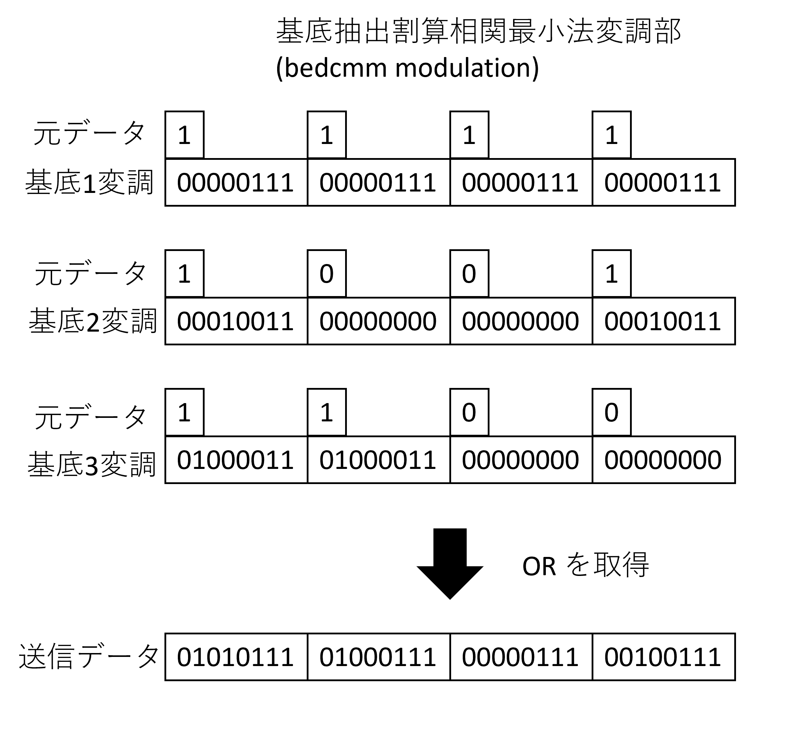
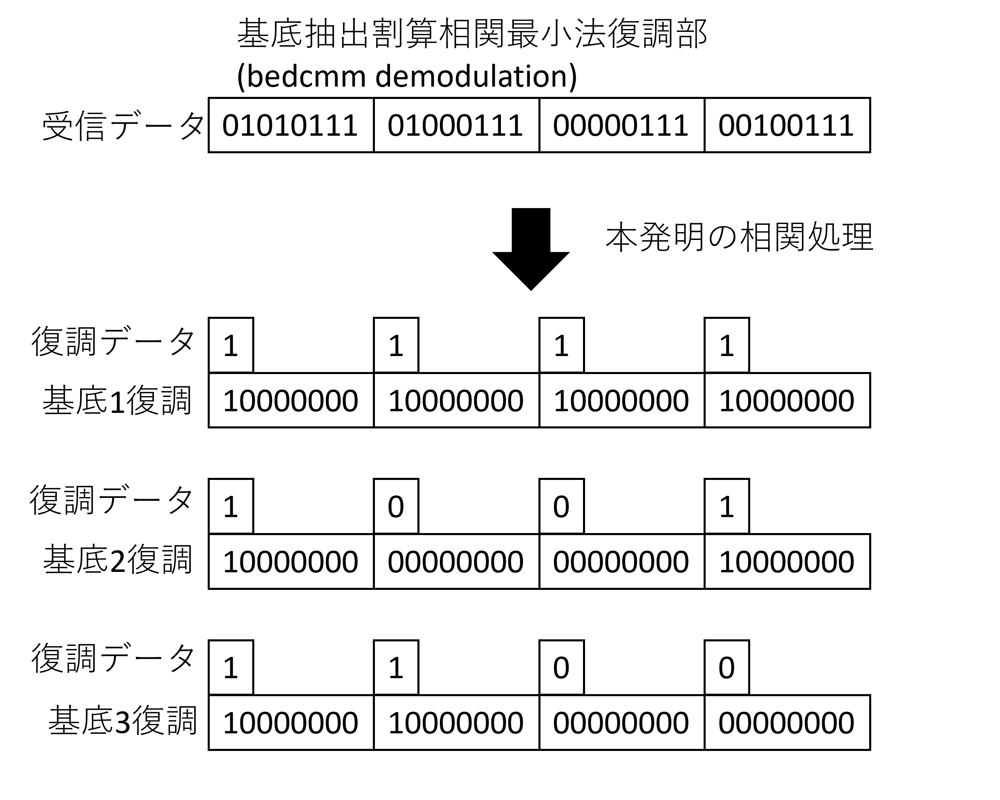
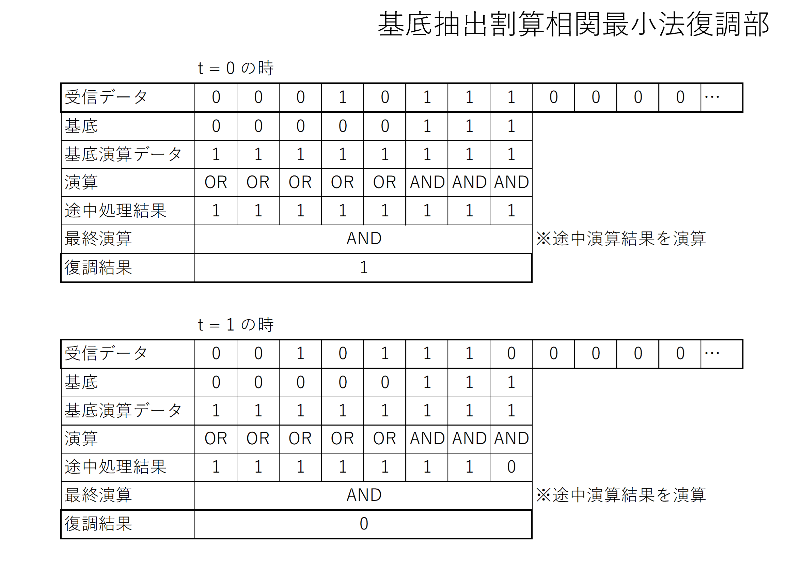

## bedcmmの基礎理論
基底を設定し、0以外の値を基底の値で割算し、その最小値を相関値とするのが、
bedcmm(基底抽出割算相関最小法)の基礎理論です。

## bedcmmの通信多重の理論
バイナリの信号に対し、信号を復調する際に、bedcmmを使用するのがbedcmmを使った通信多重化です。
### 変調
変調(拡散)する時は、バイナリの基底長分だけ長くして、1の時は基底を、0の時は基底長の0を入れます。

### 復調
復調する時は、図のようにbedcmmにより相関値を取得し、この後に適切な遅延フィルタをかけ、元のビット数の間隔でデータを取得すれば、データが取得可能となります。

- 復調(概要)

bedcmmで相関を取得するので、基底の1の部分のみの信号の中で最小を取得します。
つまり、1の部分のみで0が無ければ1,0があれば0となります。なので、図のような処理が可能となります。

- 復調(コア処理)

## 理論値による系列比較表（例）
(chatGPTを元に作成したので間違いがある可能性もあります。)

| 項目                           | bedcmm               | Gold系列（n=5）            | Walsh符号（長さ16）        | ZC系列（例：長さ13）      |
|--------------------------------|-----------------------------|----------------------------|-----------------------------|----------------------------|
| **量子化ビット数**             | **1bit**（前提）            | 6〜8bit（通常前提）        | 4〜8bit（直交前提）         | 4〜8bit（複素位相依存）    |
| **系列長**                    | **12**(試験的計算範囲が12まで)                      | 31                         | 16（2⁴）                    | 13（素数）                 |
| **最大理論多重数**             | **5**（計算済み）           | 33（理論値）               | 16（完全直交）              | 1（主に自己相関用）        |
| **自己相関特性**               | 良好（1bit設計に適応）      | 優秀（2値）                | 完全直交                    | 優秀（ゼロ以外小）         |
| **相互相関特性**               | 0               | -1, 0, 1（3値）            | 0（完全直交）               | 離れれば小                 |
| **復調計算コスト**             | **低い(論理演算のみ)** | 中（相関）                 | 中（直交演算）              | 高（FFT/複素内積）         |
| **1bitとの親和性**            | **高**    | 低（ADC依存）              | 低（振幅直交依存）          | 低（複素直交）             |
| **主な応用分野**               | IoT、低消費電力通信(これから)         | CDMA、GPS                  | 無線LAN、制御通信           | 5G、レーダ、音響処理       |

## bedcmmによる多重化の最大理論多重数

| 信号長      | 6 | 7 | 8 | 9 | 10 | 11 | 12 |
|-------------|---|---|---|---|----|----|----|
| 理論多重化数 | 2 | 2 | 3 | 3 | 4  | 4  | 5  | 
