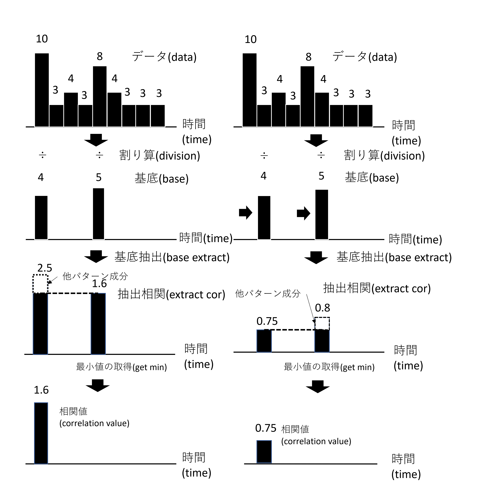
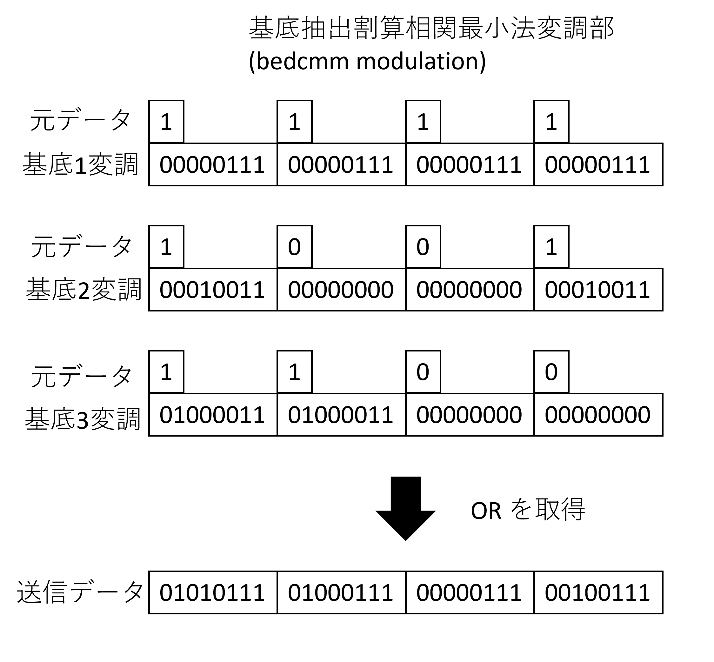
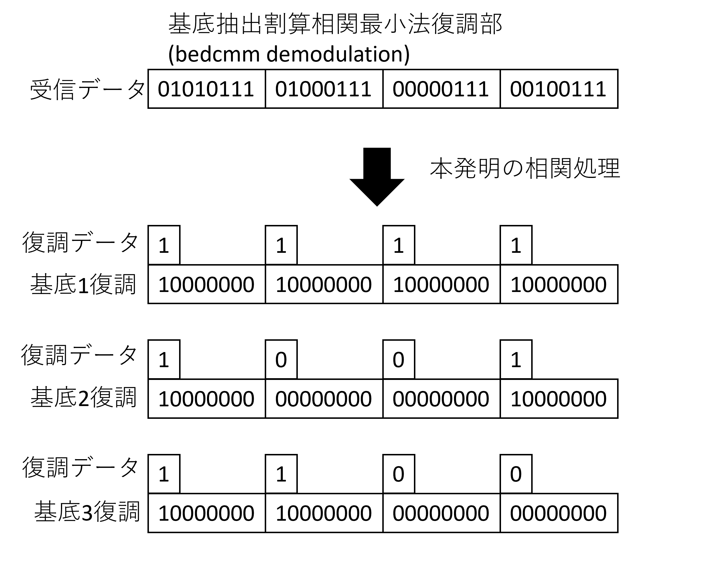
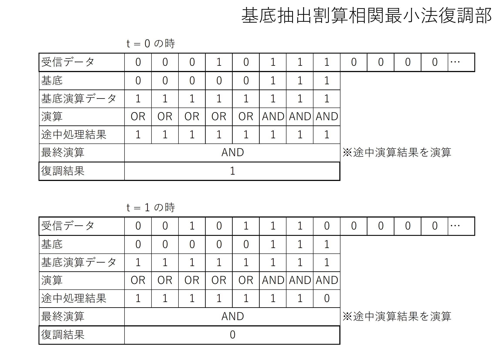

## bedcmmの基礎理論
基底を設定し、0以外の値を基底の値で割算し、その最小値を相関値とするのが、
bedcmm(基底抽出割算相関最小法)の基礎理論です。

## bedcmmの通信多重の理論
バイナリの信号に対し、信号を復調する際に、bedcmmを使用するのがbedcmmを使った通信多重化です。
### 変調
変調(拡散)する時は、バイナリの基底長分だけ長くして、1の時は基底を、0の時は基底長の0を入れます。

### 復調
復調する時は、図のようにbedcmmにより相関値を取得し、この後に適切な遅延フィルタをかけ、元のビット数の間隔でデータを取得すれば、データが取得可能となります。

- 復調(概要)

bedcmmで相関を取得するので、基底の1の部分のみの信号の中で最小を取得します。
つまり、1の部分のみで0が無ければ1,0があれば0となります。なので、図のような処理が可能となります。

- 復調(コア処理)

### 式(復調の時)
$$
\begin{aligned}
b &= (b_1,b_2,...,b_l) \\\\
x &= (x_1,x_2,x_3,...,x_m) \\\\
I(𝑏) &= \{ 𝑘 ∈ {1,2,3,…,l}|𝑏_𝑘 \neq 0 \} \\\\ 
C_i(x,b) &= \underset{k \in I(b)}{\land} x_k 
\end{aligned}
$$

## 理論値による系列比較表（例）

|系列/手法|同期条件|系列長|相互相関|量子化|多重化数|  
|--|--|--|--|--|--| 
|M系列、GOLD系列|コード位相同期が必要|長い(理論的には15～実用的には31～)|なるべく低い物を選ぶ|6 ～ 8 bit|多い|  
|zcz系列|ゾーン内の粗同期（準同期）が必要|長い(理論的には、ゾーンが1で効率が1/2、実用的には、16から)|ゾーン内は、0|4 ～ 8 bit|少ない|
|bedcmm|送信信号のシンボル境界同期が必要|短い(確認範囲:長さ6で2ユーザ – 31で19ユーザ)|0|1bit|少ない(確認の範囲)|

## bedcmmによる多重化の最大理論多重数

|信号長|理論多重化数|
|--|--|
|6|2|
|7|2|
|8|3|
|9|3|
|10|4|
|11|4|
|12|5|
|13|6|
|14|6|
|15|(7)|
|16|(8)|
|17|(9)|
|18|(9)|
|19|(10)|
|20|(11)|
|21|(12)|
|22|(12)|
|23|(13)|
|24|(14)|
|25|(15)|
|26|(15)|
|27|(16)|
|28|(17)|
|29|(17)|
|30|(18)|
|31|(19)|
|32|(20)|

※()は、一部のみ確認なので最低数
