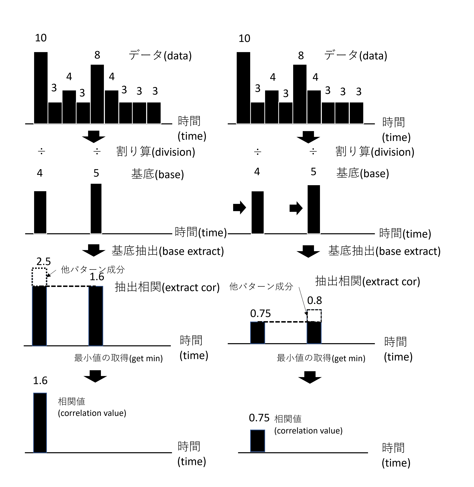
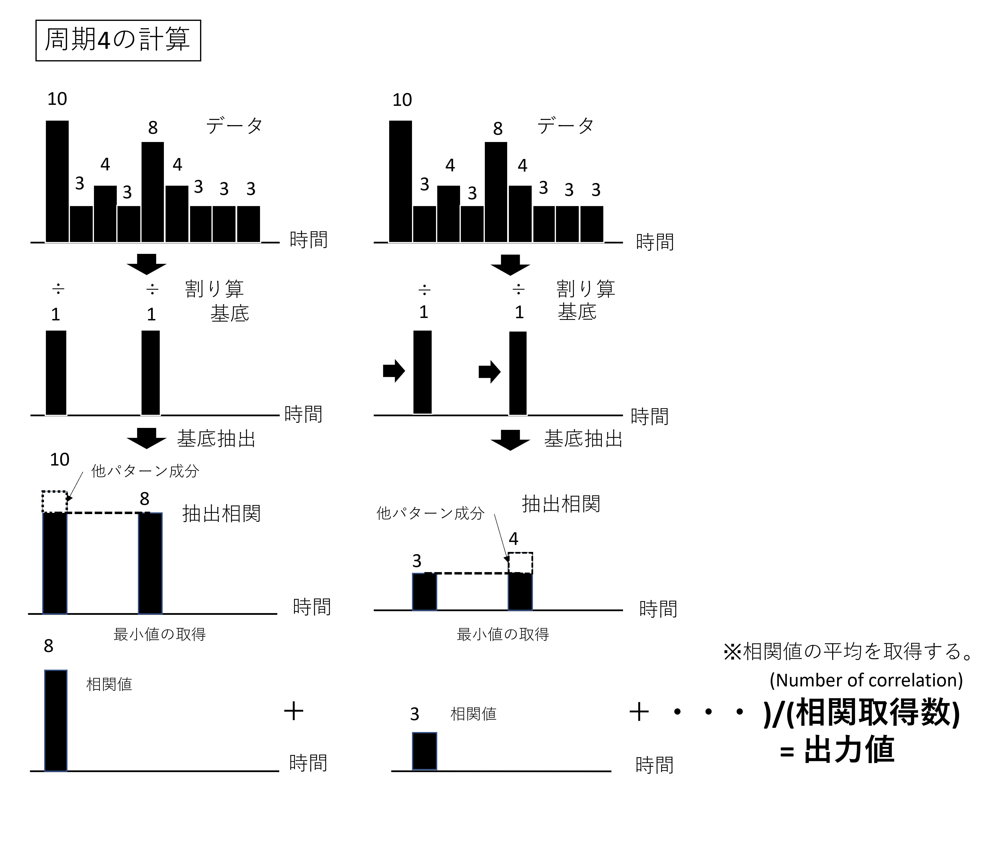

## Fundamental Theory of bedcmm

The fundamental theory of **bedcmm** (Base Extraction Division Correlation Minimum Method) is to set a base, divide all non-zero values by the base, and take the minimum of these as the correlation value.

---

## Pattern Extraction with bedcmm

Pattern extraction refers to applying the fundamental theory of bedcmm directly to arbitrary data.

If you copy the part of the data you want to detect and set the values other than the characteristic points to zero to form the base, it is considered easier to extract the desired pattern.

Also, because hidden patterns may be extracted unintentionally, data with large values may often result in detections that do not match the intended pattern.  
In such cases, create a base representing the large data and perform an exclusion process to filter it out.

---

## Periodicity Analysis with bedcmm

In periodicity analysis, a base is created using two '1's with a gap between them, filling the space with zeros. Then, the average of the correlation values is calculated.

If perfect periodicity is present, the values for each period are expected to be the same. When deviations occur, the method penalizes based on the amount of deviation.  
If the number of data points is an exact multiple of the period, and perfect periodicity exists, the average value and the calculated value from bedcmm will match.

---

## Continuity Analysis with bedcmm

While periodicity analysis uses a spaced-out base to compute an average, continuity analysis modifies this to use a **continuous base** instead.
